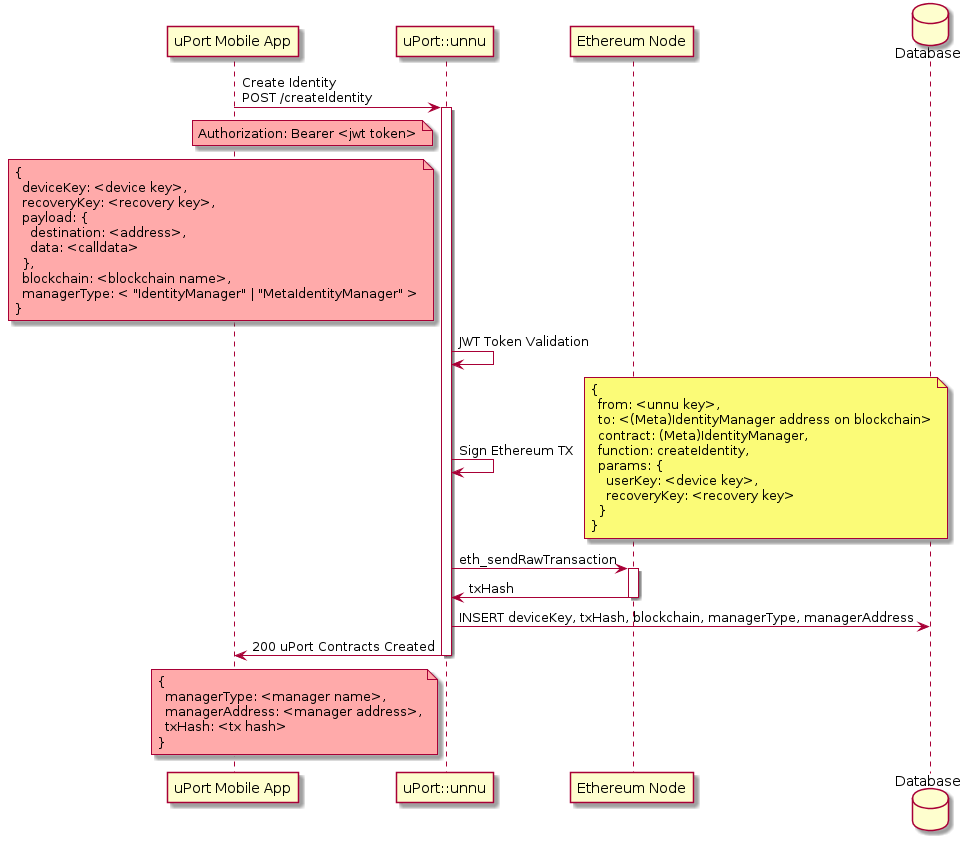
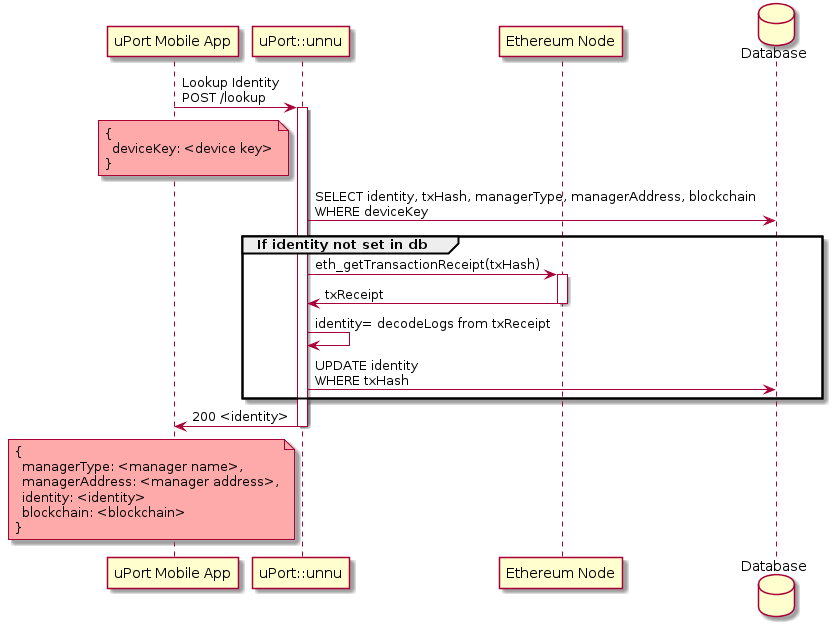

# lambda-unnu
Creator of Identities

_Jamaica and Belize: Second person plural pronoun; You plural._

[](https://circleci.com/gh/uport-project/lambda-unnu)


[](https://codecov.io/gh/uport-project/lambda-unnu)


[Diagrams](./diagrams/README.md)

## Description
Unnu is a server part of the uport-framework. The main feature is to create the initial uPort contract structure for a device key.

## API Description

### Create uPort identity
Calls the IdentityFactory, IdentityManager, or MetaIdentityManager contract to create the initial controller and proxy contract(uPortId). The proxy contract is configured to be controlled by the deviceKey. The identity factory is called in the blockchain specified by blockchain body data. If unnu does not know how to access the blockchain it returns a 404 status.

The endpoint is private, only valid "fuel tokens" from nisaba are allowed.

### Endpoint createIdentity

`POST /createIdentity`

This endpoint uses the (Meta)IdentityManager. It also allows you to make an arbitrary call from the newly created identity.

#### Header
```
Authorization: Bearer <jwt fuel token>
```

#### Body
```
{
  deviceKey: <device key>,
  recoveryKey: <recovery key>,
  payload: {
    destination: <address>,
    data: <calldata>
  },
  blockchain: <blockchain name>,
  managerType: < "IdentityManager" | "MetaIdentityManager" >
}
```
Note that payload here is optional. If not given, an identity will be created without a call.

#### Response

| Status |     Message    |                               |
|:------:|----------------|-------------------------------|
| 200    | Ok.            | uPort contracts created       |
| 400    | Bad Request    | Parameter missing or invalid  |
| 403    | Forbidden      | JWT token missing or invalid  |
| 404    | Not found      | Blockchain not found          |
| 500    | Internal Error | Internal error                |

#### Response data
```
{
  managerType: < "IdentityManager" | "MetaIdentityManager" >,
  managerAddress: <address>,
  txHash: <tx hash>
}
```

#### Sequence Diagram




### Lookup uPort identity
Look for a uPort identity created by a deviceKey.

### Endpoint lookup

`POST /lookup`

#### Body
```
{
  deviceKey: <device key>
}
```

#### Response

| Status |     Message    |                               |
|:------:|----------------|-------------------------------|
| 200    | Ok.            | uPort contracts created       |
| 400    | Bad Request    | Parameter missing or invalid  |
| 404    | Not found      | Record not found              |
| 404    | Not found      | Null identity. Not mined?     |
| 500    | Internal Error | Internal error                |

#### Response data
```
{
  managerType: < "IdentityManager" | "MetaIdentityManager" >,
  managerAddress: <address>,
  identity: <identity address>
  blockchain: <blockchain name>
}
```

#### Sequence Diagram




## Fixes
To sync the database with the nonces on the blockchain just do:

on develop
```
sls invoke local -f fixNonces
```

and on master
```
sls invoke local -f fixNonces --stage master
```


